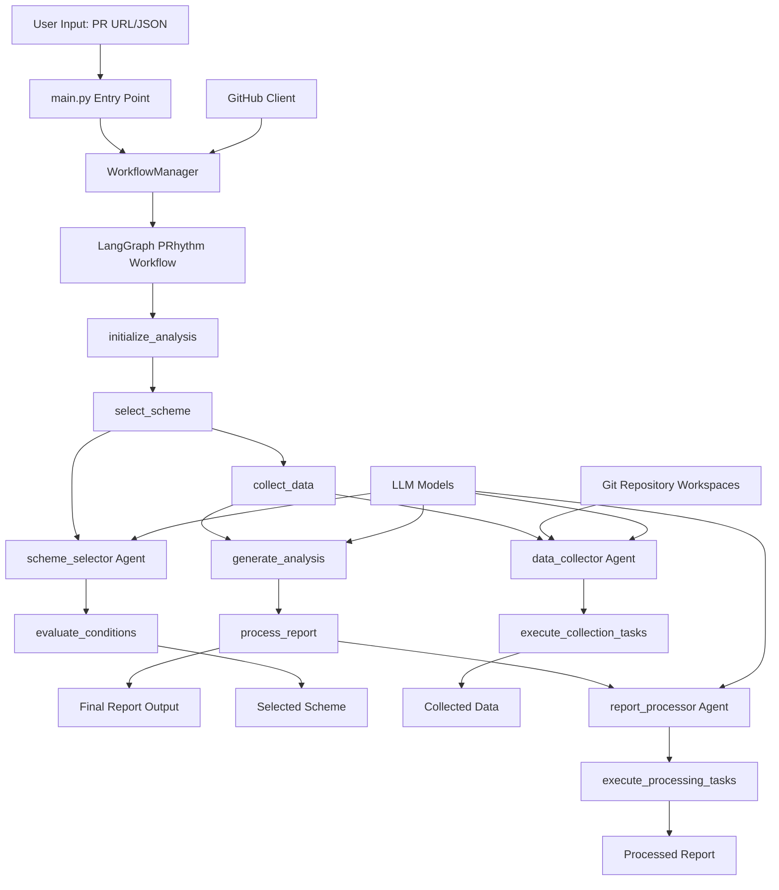
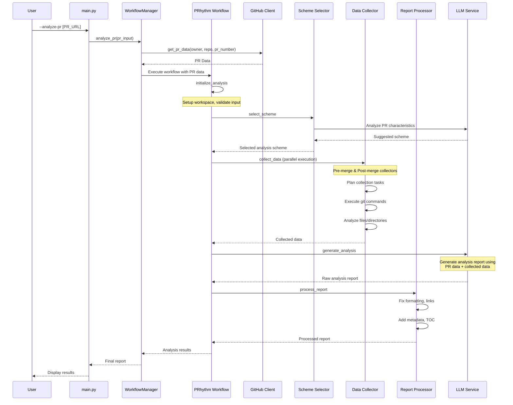
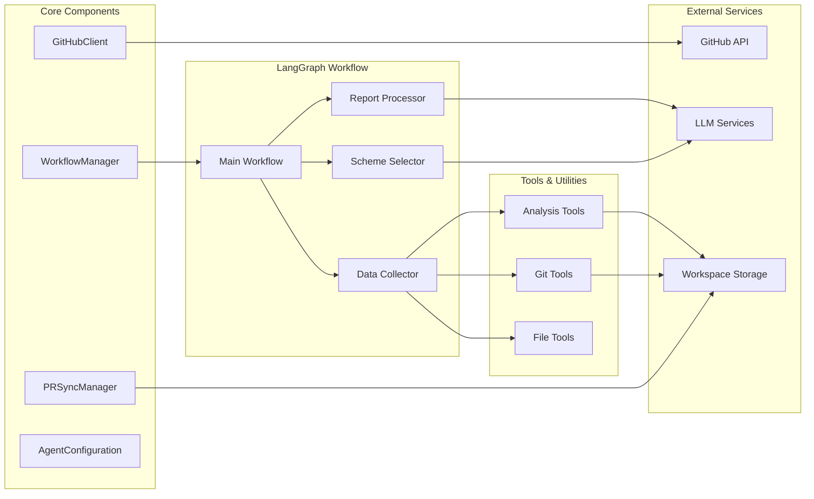

# PRhythm Project Overview

## Objective
The goal of this project is to analyze Pull Requests (PRs) for a specified GitHub repository and generate detailed analysis reports.

## Workflow

### System Architecture

### PR Analysis Process Flow

### Component Architecture

### Data Flow

1. **Input Processing**: User provides PR URL or JSON file containing PR data
2. **Workspace Setup**: System initializes workspace directories for pre-merge and post-merge analysis
3. **Scheme Selection**: Agent-1 analyzes PR characteristics to select appropriate analysis scheme
4. **Data Collection**: Agent-2 (pre-merge) and Agent-3 (post-merge) collect repository data based on scheme requirements
5. **Analysis Generation**: Main workflow aggregates all data and sends to LLM for comprehensive analysis
6. **Report Processing**: Agent-4 post-processes the raw report for better formatting and presentation
7. **Output**: Final processed report is returned to user

## PR Analysis Schemes

PR Analysis Schemes define specific types of analysis that can be performed on a PR. The system provides a set of default, generic schemes applicable to any repository. Additionally, a repository can define its own custom schemes tailored to its specific needs, coding standards, or analysis goals.

The system will first look for a scheme definition within the target repository's configuration. If a matching scheme for the PR is found there, it will be used. If not, the system falls back to the built-in default schemes.

*   **Default Scheme Placeholder 1**: A generic analysis type provided by the system. (e.g., General Code Review)
    *   **Requires**: Pre-merge data, Post-merge data, PR metadata
    *   **Focus**: A broad review covering code changes, potential issues, and summary based on all available data.
*   **Default Scheme Placeholder 2**: Another generic analysis type. (e.g., Changelog Generation)
    *   **Requires**: Post-merge data, PR metadata
    *   **Focus**: Generating a user-friendly changelog entry based on the PR's impact and description.
*   **Repo-Specific Scheme Example**: A custom scheme defined within a specific repository's configuration.
    *   **Requires**: As defined by the repository's scheme configuration.
    *   **Focus**: As defined by the repository's scheme configuration (e.g., checking adherence to a specific internal guideline or framework usage).
