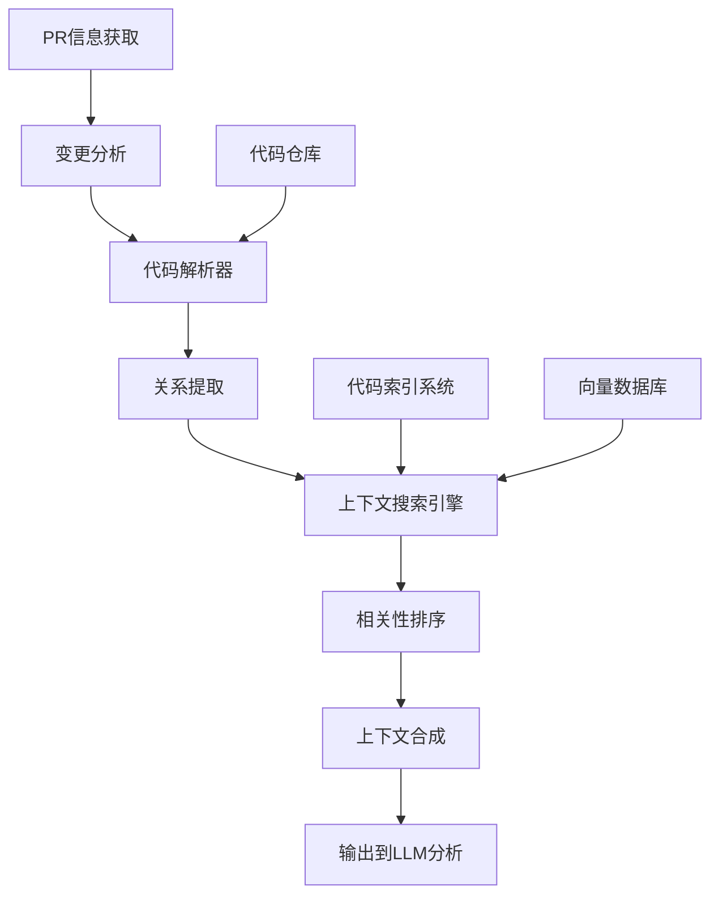

# 基于Agent的PR上下文提取技术方案

## 1. 背景与问题

当前PRhythm工具在分析PR时，采用将整个修改文件内容放入提示词（prompt）的方式来提供代码上下文。这种方法存在明显问题：

- **效率低下**：注入大量无关代码消耗token
- **上下文不聚焦**：完整文件包含过多与PR变更无直接关系的代码
- **成本问题**：大量token消耗增加API调用成本
- **分析质量下降**：信息过载导致LLM关注点分散

## 2. 解决方案概述

提出基于Agent的PR上下文提取系统，通过智能代理技术从大型代码仓库中精确提取与PR变更最相关的代码段，替代现有的整文件注入方法。该系统将：

- 智能识别PR变更的关键部分
- 分析代码结构和依赖关系
- 精确提取相关代码段及必要上下文
- 动态调整上下文范围，保持关键信息
- 优化token使用，提高分析质量和效率

## 3. 系统架构

### 3.1 整体架构



### 3.2 主要组件

1. **PR变更分析器**：解析PR差异，识别修改的文件和代码段
2. **代码解析器**：分析代码结构，提取符号定义和引用
3. **关系提取器**：构建函数调用图、继承关系和依赖关系
4. **上下文搜索引擎**：基于代码结构和语义相似度搜索相关代码
5. **相关性排序**：根据重要性和相关性对代码段进行排序
6. **上下文合成器**：整合和格式化最终提供给LLM的上下文

## 4. 实现细节

### 4.1 精确代码段定位

```python
def locate_code_segment(repo_path, target_info):
    # 根据不同定位方式提取代码段
    if "function_name" in target_info:
        # 通过函数名定位
        return extract_function_definition(file_path, target_info["function_name"])
    elif "class_name" in target_info:
        # 通过类名定位
        return extract_class_definition(file_path, target_info["class_name"])
    elif "line_range" in target_info:
        # 通过行号范围定位
        start, end = target_info["line_range"]
        return extract_lines(file_path, start, end)
    elif "symbol" in target_info:
        # 通过符号名定位
        return extract_symbol_context(file_path, target_info["symbol"])
```

### 4.2 AST解析与符号提取

```python
def extract_function_definition(file_path, function_name):
    # 解析AST
    ast = parse_file(file_path)
    
    # 查找特定函数定义
    function_node = find_function_in_ast(ast, function_name)
    
    if function_node:
        # 获取函数定义的源代码位置
        start_line = function_node.lineno
        end_line = find_function_end(function_node)
        
        # 提取代码段
        return {
            "file_path": file_path,
            "start_line": start_line,
            "end_line": end_line,
            "content": extract_lines(file_path, start_line, end_line),
            "type": "function"
        }
```

### 4.3 调用关系分析

```python
def collect_context(repo_url, changed_entities, depth=2):
    context = {}
    for entity in changed_entities:
        # 添加实体本身
        context[entity.id] = get_entity_code(repo_url, entity)
        
        # 递归收集调用关系
        if depth > 0:
            # 查找调用此实体的代码
            callers = find_callers(repo_url, entity)
            # 查找此实体调用的代码
            callees = find_callees(repo_url, entity)
            
            # 递归收集上下文
            caller_context = collect_context(repo_url, callers, depth-1)
            callee_context = collect_context(repo_url, callees, depth-1)
            
            context.update(caller_context)
            context.update(callee_context)
    return context
```

### 4.4 语义搜索实现

```python
def find_related_code(repo_url, entity, top_k=5):
    # 将实体代码转换为向量
    entity_vector = code_embedder.embed(entity.code)
    
    # 在向量数据库中搜索相似代码
    similar_vectors = vector_db.search(
        collection="code_embeddings",
        query_vector=entity_vector,
        top_k=top_k
    )
    
    # 返回相关代码段
    return [get_code_by_id(match.id) for match in similar_vectors]
```

### 4.5 LLM指导搜索

```python
def llm_guided_search(pr_diff):
    # 初始上下文
    context = {"diff": pr_diff}
    
    for i in range(MAX_ITERATIONS):
        # LLM分析当前上下文
        analysis = llm.analyze(
            prompt="分析这个PR差异并说明需要什么额外上下文",
            context=context
        )
        
        # 提取搜索需求
        search_requests = extract_search_requests(analysis)
        if not search_requests:
            break  # LLM认为上下文足够
            
        # 执行搜索
        for request in search_requests:
            result = execute_search(request)
            context[request.id] = result
    
    return context
```

## 5. 技术选型

| 组件 | 推荐技术 | 备选方案 | 选择理由 |
|------|---------|---------|---------|
| Agent框架 | LangChain | AutoGPT, LlamaIndex | 成熟、生态丰富、工具集成能力强 |
| 代码解析工具 | Tree-sitter | 语言特定解析器, Semgrep | 通用性好、性能高、支持多语言 |
| 向量数据库 | Milvus (大型项目) / FAISS (小型项目) | Pinecone, Weaviate | 开源、高性能、易于部署 |
| 代码嵌入模型 | GraphCodeBERT | CodeBERT, OpenAI Embeddings | 理解代码结构能力强 |
| 搜索策略 | 混合策略 | 单一策略 | 结合结构和语义提高准确性 |
| 代码索引 | 分层索引 | 全量索引, 增量索引 | 平衡性能和准确性 |
| 部署方式 | 独立服务+GitHub App | CI/CD集成, IDE插件 | 灵活性和集成度平衡 |

## 6. 实施路线

### 第一阶段：核心功能实现
1. 开发基础Agent框架和工具集
2. 实现代码解析和符号提取
3. 构建基本调用关系分析
4. 开发简单上下文排序算法

### 第二阶段：增强与优化
1. 集成向量数据库和语义搜索
2. 实现LLM指导搜索策略
3. 开发高级上下文优先级排序
4. 性能优化和大型仓库支持

### 第三阶段：集成与部署
1. 开发GitHub App或API服务
2. 与现有PR分析流程集成
3. 实现监控和报告功能
4. 用户反馈收集和系统调优

## 7. 效益分析

| 指标 | 当前方法 | Agent方法 | 改进 |
|------|---------|----------|------|
| Token消耗 | 高 | 降低60-80% | 显著降低API成本 |
| 分析质量 | 中 | 高 | 提高PR分析准确性 |
| 处理时间 | 长 | 略长 | 额外处理时间被分析质量提升抵消 |
| 适用性 | 小型PR | 各种规模PR | 扩大工具适用范围 |
| 维护成本 | 低 | 中 | 需要维护额外系统组件 |

## 8. 结论

基于Agent的PR上下文提取系统能够智能识别和提取与PR最相关的代码上下文，相比当前整文件注入方法，能显著提高分析质量，降低API调用成本。该方案技术上完全可行，主要依赖成熟的开源工具链，实现复杂度适中。

建议采用渐进式实施策略，先开发核心提取能力，再逐步增强语义分析和集成能力，最终实现与现有PR分析流程的无缝衔接。 