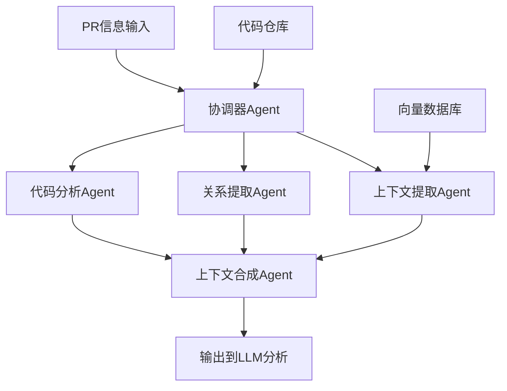

# 基于Agent的PR上下文提取技术方案

## 1. 背景与问题

当前PRhythm工具在分析PR时，采用将整个修改文件内容放入提示词（prompt）的方式来提供代码上下文。这种方法存在明显问题：

- **效率低下**：注入大量无关代码消耗token
- **上下文不聚焦**：完整文件包含过多与PR变更无直接关系的代码
- **成本问题**：大量token消耗增加API调用成本
- **分析质量下降**：信息过载导致LLM关注点分散

## 2. 解决方案概述

提出基于Agent的PR上下文提取系统，通过智能代理技术从大型代码仓库中精确提取与PR变更最相关的代码段，替代现有的整文件注入方法。该系统将：

- 智能识别PR变更的关键部分
- 分析代码结构和依赖关系
- 精确提取相关代码段及必要上下文
- 动态调整上下文范围，保持关键信息
- 优化token使用，提高分析质量和效率

## 3. 系统架构

### 3.1 Agent系统架构


```mermaid
graph TD
    A[PR信息输入] --> B[协调器Agent]
    B --> C[代码分析Agent]
    B --> D[关系提取Agent]
    B --> E[上下文提取Agent]
    C --> F[上下文合成Agent]
    D --> F
    E --> F
    F --> G[输出到LLM分析]
    
    H[代码仓库] --> B
    I[向量数据库] --> E
```

### 3.2 主要Agent组件

1. **协调器Agent (Coordinator Agent)**：
   - 管理整个上下文提取过程，协调其他专业Agent的工作
   - 分析PR差异，确定需要部署的专业Agent及其工作顺序
   - 收集和验证各Agent输出，确保上下文提取的完整性和质量

2. **代码分析Agent (Code Analyzer Agent)**：
   - 分析代码结构、逻辑和模式
   - 识别完整代码单元（函数、类等）
   - 分析执行逻辑和控制流
   - 识别关键代码模式和设计原则
   - 提供代码质量观察

3. **关系提取Agent (Relationship Extractor Agent)**：
   - 发现和映射代码组件之间的关系
   - 识别调用关系、继承关系、依赖关系
   - 分析数据流关系、导入/导出关系
   - 比较PR变更前后的关系变化

4. **上下文提取Agent (Context Extraction Agent)**：
   - 提取最相关的代码上下文
   - 确定被修改代码（变更前后版本）
   - 提取周围提供上下文的代码
   - 识别其他文件中与修改代码交互的相关代码

5. **上下文合成Agent (Context Synthesizer Agent)**：
   - 整合来自不同分析Agent的输出
   - 将信息组织为清晰的"变更前"和"变更后"部分
   - 识别共享/未更改但相关的上下文
   - 优化最终输出，确保完整性和一致性

## 4. Agent工作流程与实现

### 4.1 协调器Agent工作流程

1. **初始PR分析**：
   - 检查PR差异以了解变更范围和性质
   - 识别受影响的关键文件、函数和组件
   - 确定受影响的技术领域（前端、后端、数据库等）

2. **任务规划**：
   - 根据PR特性决定调用哪些Agent
   - 为每个Agent定义特定任务和关注领域
   - 创建Agent调用序列

3. **Agent协调**：
   - 以适当的指令调用每个Agent
   - 监控Agent进度和中间输出
   - 根据发现调整Agent任务

4. **输出集成与验证**：
   - 收集所有专业Agent的输出
   - 验证上下文的完整性和质量
   - 确保提取的上下文涵盖PR的所有重要方面

### 4.2 代码提取实现 (概念示例)

```python
def extract_relevant_context(pr_diff, repo_path):
    # Note: This is a conceptual representation.
    # Actual implementation uses Agent framework like LangChain.
    
    # Initialize coordinator agent
    coordinator = CoordinatorAgent(pr_diff, repo_path)
    
    # Plan tasks for specialized agents
    tasks = coordinator.plan_tasks()
    
    # Invoke Code Analyzer Agent
    code_analyzer = CodeAnalyzerAgent(repo_path)
    code_analysis = code_analyzer.analyze(tasks['code_analysis_tasks'])
    
    # Invoke Relationship Extractor Agent
    relationship_extractor = RelationshipExtractorAgent(repo_path)
    relationship_analysis = relationship_extractor.extract_relationships(
        tasks['relationship_extraction_tasks']
    )
    
    # Invoke Context Extraction Agent
    context_extractor = ContextExtractionAgent(repo_path)
    extracted_context = context_extractor.extract_context(
        tasks['context_extraction_tasks']
    )
    
    # Invoke Context Synthesizer Agent to integrate all information
    context_synthesizer = ContextSynthesizerAgent()
    final_context = context_synthesizer.synthesize(
        code_analysis, 
        relationship_analysis,
        extracted_context
    )
    
    # Return the final formatted context
    return final_context
```

### 4.3 上下文格式化输出

系统将输出结构化JSON，清晰分离变更前后的上下文：

```json
{
  "before_context": {
    "code_segments": [
      {
        "file_path": "path/to/file.ext",
        "segment_type": "function|class|module",
        "name": "entity_name",
        "code": "完整代码段（变更前）",
        "importance": "high|medium|low",
        "reason": "此代码对理解PR的重要性"
      }
    ],
    "architectural_elements": {
      "description": "变更前架构的简要描述",
      "key_components": [
        {
          "name": "组件名称",
          "responsibility": "组件功能",
          "relationships": ["与其他组件的关系"]
        }
      ]
    }
  },
  "after_context": {
    "code_segments": [
      {
        "file_path": "path/to/file.ext",
        "segment_type": "function|class|module",
        "name": "entity_name",
        "code": "完整代码段（变更后）",
        "importance": "high|medium|low",
        "reason": "此代码对理解PR的重要性"
      }
    ],
    "architectural_elements": {
      "description": "变更后架构的简要描述",
      "key_components": [
        {
          "name": "组件名称",
          "responsibility": "组件功能",
          "relationships": ["与其他组件的关系"]
        }
      ]
    }
  },
  "shared_context": {
    "code_segments": [
      {
        "file_path": "path/to/file.ext",
        "segment_type": "function|class|module",
        "name": "entity_name",
        "code": "未变更但相关的代码",
        "importance": "high|medium|low",
        "reason": "此代码对理解PR的重要性"
      }
    ],
    "dependencies": [
      {
        "name": "依赖名称",
        "type": "library|framework|internal",
        "usage": "在此PR上下文中的使用方式"
      }
    ]
  },
  "context_summary": {
    "key_changes": [
      "最重要变更的总结"
    ],
    "implications": [
      "这些变更对代码库的影响"
    ],
    "related_areas": [
      "可能受这些变更影响的其他代码区域"
    ]
  }
}
```

### 4.4 LangChain 实现方案细节

以下部分详细说明如何使用 LangChain 框架实现上述 Agent 系统。

#### 4.4.1 获取代码修改前后的嵌入向量

获取代码嵌入向量是语义搜索和理解代码变化的基础，步骤如下：

1.  **识别变更代码单元**:
    *   `CoordinatorAgent` 使用 `get_pr_diff` 工具获取 PR 差异信息。
    *   利用 `parse_diff` 等库解析差异，定位到变更的文件和行号。
    *   结合 `parse_code` 工具（封装 Tree-sitter 等）找到包含变更的完整代码单元（函数、类）。

2.  **获取变更前代码**:
    *   使用 `get_code_at_commit` 工具，传入父提交哈希和文件路径，获取变更前的完整文件内容。
    *   再次使用 `parse_code` 工具从旧文件内容中精确提取出目标代码单元。

3.  **获取变更后代码**:
    *   使用 `read_file` 或 `get_current_code_segment` 工具读取当前分支的文件内容。
    *   使用 `parse_code` 工具提取目标代码单元的新版本。

4.  **生成嵌入向量**:
    *   配置 LangChain 的嵌入模型，如 `HuggingFaceEmbeddings` 加载 `GraphCodeBERT`。
    *   调用嵌入模型的 `embed_query` 方法，分别传入变更前和变更后的代码字符串，生成向量。
        ```python
        # Example using HuggingFaceEmbeddings
        from langchain_community.embeddings import HuggingFaceEmbeddings

        model_name = "microsoft/graphcodebert-base" 
        embeddings = HuggingFaceEmbeddings(model_name=model_name)
        
        code_before = "..." # Old code content
        code_after = "..."  # New code content

        embedding_before = embeddings.embed_query(code_before)
        embedding_after = embeddings.embed_query(code_after)
        ```

#### 4.4.2 使用嵌入向量进行语义搜索

嵌入向量仅是上下文提取的一部分工具，主要用于发现语义相似但可能没有直接结构关系的相关代码：

1.  **构建代码库向量索引**: 需要预先对代码库进行处理，提取代码单元，生成嵌入并存入向量数据库（如 FAISS, Milvus），并用 LangChain 的 `VectorStore` 接口封装。

2.  **执行语义搜索**:
    *   `ContextExtractionAgent` 接收变更后代码的嵌入向量 `embedding_after`。
    *   使用 `vectorstore_search` 工具，将 `embedding_after` 作为查询向量，在代码库索引中搜索最相似的 `k` 个代码片段。
        ```python
        # Assuming 'vector_store' is a LangChain VectorStore object
        similar_docs = vector_store.similarity_search_by_vector(
            embedding=embedding_after,
            k=5 
        )
        ```
    *   搜索结果用于丰富上下文，帮助理解变更影响或发现相关实现。

#### 4.4.3 Agent间交互示例 (LangChain)

模拟一个修改 `user_service.py` 中 `update_user_profile` 函数的 PR 场景：

1.  **触发 -> `CoordinatorAgent`**: 接收 PR#123 diff 信息。
2.  **`CoordinatorAgent` 规划**: 分析 diff，决定需要代码分析、关系提取和上下文提取。
3.  **`CoordinatorAgent` 委派 (使用 `delegate_task` 或直接调用工具/Agent)**:
    *   -> `CodeAnalyzerAgent`: "Analyze structure of `update_user_profile` (before/after PR#123)."
    *   -> `RelationshipExtractorAgent`: "Identify relationships for `update_user_profile` (before/after PR#123)."
    *   -> `ContextExtractionAgent`: "Extract context for `update_user_profile` changes (PR#123), use semantic search." (传递 `embedding_after`)
4.  **专业 Agent 执行**: 各 Agent 使用相应工具 (如 `parse_code`, `vectorstore_search`, `find_callers`) 完成任务，返回 JSON 结果。
5.  **结果 -> `CoordinatorAgent`**: 收集所有分析结果。
6.  **`CoordinatorAgent` -> `ContextSynthesizerAgent`**: "Synthesize these analyses for PR#123 into a final context document."
7.  **`ContextSynthesizerAgent` 执行**: 整合信息，生成最终 JSON。
8.  **最终结果 -> `CoordinatorAgent`**: 返回最终上下文。
9.  **`CoordinatorAgent` -> 下游LLM**: 将上下文用于 PR 分析。

*(实现方式: LangChain `SequentialChain`, `AgentExecutor` 或自定义 Chain)*

#### 4.4.4 各Agent可调用的LangChain工具

以下是为每个 Agent 设计的 LangChain `Tool` 列表：

**通用工具**

*   `read_file(file_path: str) -> str`: 读取文件。
*   `get_code_at_commit(commit_hash: str, file_path: str) -> str`: 获取旧版本文件。
*   `get_current_code_segment(file_path: str, start_line: int, end_line: int) -> str`: 获取当前代码片段。
*   `parse_code(code: str, language: str) -> dict`: 解析代码结构。
*   `get_pr_diff(pr_number: int) -> str`: 获取 PR diff。

**`CoordinatorAgent`**

*   `analyze_pr_diff(diff: str) -> dict`: (内部逻辑或LLM) 分析diff。
*   `delegate_task(agent_name: str, task_description: str, context: dict) -> dict`: (核心) 调用其他Agent。

**`CodeAnalyzerAgent`**

*   `parse_code`
*   `identify_code_patterns(code_segment: str) -> list`: 识别模式。
*   `analyze_control_flow(code_segment: str) -> dict`: 分析控制流。
*   `assess_code_quality(code_segment: str) -> dict`: 评估质量。

**`RelationshipExtractorAgent`**

*   `parse_code`
*   `find_callers(function_name: str, file_path: str) -> list`: 查找调用者。
*   `find_callees(function_name: str, file_path: str) -> list`: 查找被调用者。
*   `analyze_dependencies(file_path: str) -> dict`: 分析依赖。
*   `map_inheritance(class_name: str, file_path: str) -> dict`: 映射继承关系。

**`ContextExtractionAgent`**

*   `get_code_at_commit`
*   `get_current_code_segment`
*   `parse_code`
*   `vectorstore_search(query_embedding: list[float], k: int) -> list[dict]`: 语义搜索。

**`ContextSynthesizerAgent`**

*   `format_output_json(data: dict) -> str`: (可能需要) 确保输出格式。

#### 4.4.5 结构分析与语义分析相结合的完整流程

仅依靠嵌入向量的语义相似度搜索无法完整提取与修改处有关联的上下文，如调用链关系、继承结构等。完整的上下文提取需要结合结构分析和语义分析：

1. **结构分析的局限性**：
   * 无法发现没有直接调用关系但功能相似的代码
   * 难以判断间接相关但对理解变更有价值的代码
   * 缺乏对代码整体意图的理解

2. **语义分析的局限性**：
   * 无法精确识别调用关系、继承结构等
   * 不理解变量作用域和生命周期
   * 缺乏对程序控制流的理解

3. **完整上下文提取流程**：

```python
def extract_complete_context(changed_entity, repo_path):
    # 阶段1: 结构分析 - 提取直接关联代码
    structure_context = extract_structural_context(changed_entity, repo_path)
    
    # 阶段2: 语义分析 - 查找语义相似代码
    embedding = create_embedding(changed_entity.code)
    semantic_context = search_semantic_similar_code(embedding)
    
    # 阶段3: 上下文集成 - 整合并去重
    combined_context = integrate_contexts(structure_context, semantic_context)
    
    # 阶段4: 重要性排序 - 根据与变更的相关性排序
    ranked_context = rank_by_relevance(combined_context, changed_entity)
    
    # 阶段5: 上下文剪裁 - 控制上下文大小，保留最重要部分
    final_context = prune_context(ranked_context, max_tokens=8000)
    
    return final_context

def extract_structural_context(entity, repo_path):
    context = {}
    
    # 获取直接调用关系
    callers = find_callers(entity.name, entity.file_path)
    callees = find_callees(entity.name, entity.file_path)
    
    # 获取继承关系（如果是类）
    if entity.type == "class":
        parent_classes = find_parent_classes(entity.name)
        child_classes = find_child_classes(entity.name)
        
    # 获取同文件中的相关定义
    sibling_entities = find_sibling_entities(entity.file_path, entity.name)
    
    # 获取导入和被导入关系
    imports = analyze_imports(entity.file_path)
    imported_by = find_imported_by(entity.file_path)
    
    # 整合所有结构关系
    context = {
        "callers": callers,
        "callees": callees,
        "class_hierarchy": {
            "parents": parent_classes if entity.type == "class" else [],
            "children": child_classes if entity.type == "class" else []
        },
        "sibling_entities": sibling_entities,
        "import_relations": {
            "imports": imports,
            "imported_by": imported_by
        }
    }
    
    return context
```

这种结合方法能够提供更全面的上下文信息，既包括结构关系，也包括语义关联。在实际实现中，`RelationshipExtractorAgent` 负责结构分析部分，`ContextExtractionAgent` 结合结构信息和语义搜索结果，最终由 `ContextSynthesizerAgent` 整合为统一的上下文表示。

#### 4.4.6 代码仓库高阶视角理解方案

基于传统的代码分析方法（如AST解析）确实存在缺乏全局视角的局限性。以下是一个更实用、可执行的高阶代码理解实现方案：

##### 4.4.6.1 基于依赖图的全局代码地图构建

使用现有成熟工具构建代码依赖图并与LangChain集成：

1. **依赖图构建工具选择**：
   * Python项目：使用 `pydeps` 或 `pyreverse`
   * JavaScript/TypeScript：使用 `madge` 或 `dependency-cruiser`
   * Java：使用 `jdeps`
   * 通用工具：`Understand` 或 GitHub开源的 `semantic`

2. **具体实现步骤**：

```python
from langchain_community.graphs import NetworkxEntityGraph
import networkx as nx
import subprocess
import json
import os

class CodeDependencyMapper:
    def __init__(self, repo_path, language="python"):
        self.repo_path = repo_path
        self.language = language
        self.graph = nx.DiGraph()
        
    def build_dependency_graph(self):
        """构建代码依赖图并返回NetworkX图对象"""
        if self.language == "python":
            # 使用pydeps生成依赖数据
            output_file = "dependencies.json"
            cmd = f"pydeps {self.repo_path} --no-show --output-format json --output {output_file}"
            subprocess.run(cmd, shell=True, check=True)
            
            # 读取生成的JSON
            with open(output_file, 'r') as f:
                deps_data = json.load(f)
            
            # 构建图
            for module, deps in deps_data.get("depends", {}).items():
                for dep in deps:
                    self.graph.add_edge(module, dep)
                    
        elif self.language in ["javascript", "typescript"]:
            # 使用madge生成依赖数据
            result = subprocess.run(
                f"npx madge --json {self.repo_path}",
                shell=True, capture_output=True, text=True
            )
            deps_data = json.loads(result.stdout)
            
            # 构建图
            for module, deps in deps_data.items():
                for dep in deps:
                    self.graph.add_edge(module, dep)
        
        # 添加节点属性
        self._enrich_graph_with_metadata()
        
        return self.graph
    
    def _enrich_graph_with_metadata(self):
        """添加节点元数据，如模块大小、复杂度等"""
        for node in self.graph.nodes:
            file_path = os.path.join(self.repo_path, node)
            if os.path.exists(file_path):
                # 添加文件大小
                self.graph.nodes[node]['size'] = os.path.getsize(file_path)
                
                # 添加修改频率（可从git历史获取）
                change_frequency = self._get_change_frequency(node)
                self.graph.nodes[node]['change_frequency'] = change_frequency
                
                # 根据入度/出度判断模块重要性
                self.graph.nodes[node]['importance_score'] = (
                    self.graph.in_degree(node) * 2 + self.graph.out_degree(node)
                )
    
    def _get_change_frequency(self, file_path):
        """获取文件的修改频率"""
        cmd = f"git -C {self.repo_path} log --pretty=format: --name-only -- {file_path} | sort | uniq -c | sort -rg"
        result = subprocess.run(cmd, shell=True, capture_output=True, text=True)
        # 简单处理：取行数作为修改次数
        changes = len(result.stdout.strip().split('\n'))
        return changes if changes > 0 else 0
    
    def convert_to_langchain_entity_graph(self):
        """转换为LangChain的EntityGraph格式以便与Agent集成"""
        entity_graph = NetworkxEntityGraph()
        
        # 添加节点
        for node in self.graph.nodes:
            properties = {
                'type': 'module',
                'importance': self.graph.nodes[node].get('importance_score', 0),
                'size': self.graph.nodes[node].get('size', 0),
                'change_frequency': self.graph.nodes[node].get('change_frequency', 0)
            }
            entity_graph.add_node(node, properties)
        
        # 添加边
        for source, target in self.graph.edges:
            entity_graph.add_edge(
                source, target, 
                relation_type="depends_on",
                properties={}
            )
            
        return entity_graph
    
    def find_central_modules(self, top_n=5):
        """找出最核心的模块（基于中心性度量）"""
        # 计算PageRank值
        pagerank = nx.pagerank(self.graph)
        # 计算中介中心性
        betweenness = nx.betweenness_centrality(self.graph)
        
        # 组合得分
        combined_score = {node: (pagerank.get(node, 0) * 0.7 + 
                                 betweenness.get(node, 0) * 0.3)
                          for node in self.graph.nodes}
        
        # 返回得分最高的N个模块
        return sorted(combined_score.items(), key=lambda x: x[1], reverse=True)[:top_n]
```

3. **代码结构推断**：

```python
def analyze_module_structure(dependency_graph):
    """根据依赖图推断项目结构"""
    g = dependency_graph
    
    # 识别入口点（入度为0或较小的节点）
    entry_points = [n for n, d in g.in_degree() if d == 0]
    
    # 识别核心组件（高中心性节点）
    centrality = nx.betweenness_centrality(g)
    core_components = [n for n, c in sorted(centrality.items(), 
                                          key=lambda x: x[1], 
                                          reverse=True)[:5]]
    
    # 识别模块社区/组件（使用社区检测算法）
    communities = nx.community.greedy_modularity_communities(g.to_undirected())
    
    # 识别分层结构
    layers = {}
    for node in nx.topological_sort(g):
        # 计算最长路径长度
        paths_to_node = nx.algorithms.shortest_paths.generic.shortest_path_length(g, target=node)
        if paths_to_node:
            layer = max(paths_to_node.values())
            if layer not in layers:
                layers[layer] = []
            layers[layer].append(node)
    
    return {
        "entry_points": entry_points,
        "core_components": core_components,
        "communities": [list(c) for c in communities],
        "layered_structure": layers
    }
```

##### 4.4.6.2 与代码文档的整合

有效整合代码文档，提取架构级信息：

```python
from langchain_community.document_loaders import TextLoader
from langchain.text_splitter import RecursiveCharacterTextSplitter
from langchain_openai import ChatOpenAI, OpenAIEmbeddings 
from langchain.chains import LLMChain
from langchain.prompts import PromptTemplate
from langchain_community.vectorstores import FAISS
import glob
import os

class DocumentationAnalyzer:
    def __init__(self, repo_path, llm=None):
        self.repo_path = repo_path
        self.llm = llm or ChatOpenAI(temperature=0)
        self.embeddings = OpenAIEmbeddings()
        self.vector_store = None
        
    def load_documentation(self):
        """加载所有文档文件"""
        doc_files = []
        # 查找常见文档文件
        patterns = [
            "**/*.md", "**/*.rst", "**/doc/**/*.txt",
            "**/docs/**/*.txt", "**/*.py"  # Python文件中的文档字符串
        ]
        
        for pattern in patterns:
            full_pattern = os.path.join(self.repo_path, pattern)
            doc_files.extend(glob.glob(full_pattern, recursive=True))
        
        documents = []
        text_splitter = RecursiveCharacterTextSplitter(
            chunk_size=1000, chunk_overlap=200
        )
        
        for file_path in doc_files:
            try:
                loader = TextLoader(file_path)
                documents.extend(loader.load_and_split(text_splitter))
            except Exception as e:
                print(f"Error loading {file_path}: {e}")
                
        # 为所有文档创建向量存储
        if documents:
            self.vector_store = FAISS.from_documents(documents, self.embeddings)
            
        return documents
    
    def extract_architecture_information(self):
        """使用LLM从README和架构文档中提取系统架构信息"""
        # 查找常见的架构文档
        architecture_files = [
            os.path.join(self.repo_path, "README.md"),
            os.path.join(self.repo_path, "ARCHITECTURE.md"),
            os.path.join(self.repo_path, "docs/architecture.md"),
            # 添加其他可能的架构文档位置
        ]
        
        architecture_docs = []
        for file_path in architecture_files:
            if os.path.exists(file_path):
                try:
                    loader = TextLoader(file_path)
                    architecture_docs.extend(loader.load())
                except Exception as e:
                    print(f"Error loading {file_path}: {e}")
        
        if not architecture_docs:
            return {"error": "No architecture documentation found"}
        
        # 提示LLM提取架构信息
        prompt = PromptTemplate(
            input_variables=["doc_content"],
            template="""
            Based on the following documentation, extract key architectural information:
            
            {doc_content}
            
            Please provide a structured response with:
            1. Main components/modules and their responsibilities
            2. System workflow/data flow
            3. Key design patterns or architectural principles used
            4. Dependencies between components
            5. Notable constraints or technical decisions
            
            Format your response as JSON.
            """
        )
        
        chain = LLMChain(llm=self.llm, prompt=prompt)
        
        # 合并所有文档文本以供LLM分析
        combined_text = "\n\n".join([doc.page_content for doc in architecture_docs])
        
        result = chain.run(doc_content=combined_text)
        try:
            return json.loads(result)
        except:
            # 如果返回的不是有效JSON，返回原始文本
            return {"raw_result": result}
    
    def search_documentation(self, query, k=5):
        """搜索文档以回答特定问题"""
        if not self.vector_store:
            return {"error": "Vector store not initialized. Call load_documentation() first."}
        
        return self.vector_store.similarity_search(query, k=k)
```

##### 4.4.6.3 与Git历史整合

分析项目的历史变更，识别关键开发模式和热点区域：

```python
import git
from collections import Counter
from datetime import datetime, timedelta

class GitHistoryAnalyzer:
    def __init__(self, repo_path):
        self.repo_path = repo_path
        self.repo = git.Repo(repo_path)
    
    def get_file_hotspots(self, days=90):
        """找出热点文件（最频繁修改的文件）"""
        since_date = datetime.now() - timedelta(days=days)
        
        commits = list(self.repo.iter_commits(since=since_date))
        all_files = []
        
        for commit in commits:
            try:
                for file in commit.stats.files:
                    all_files.append(file)
            except:
                pass
                
        # 计数并返回前20个热点
        return Counter(all_files).most_common(20)
    
    def get_code_ownership(self, file_path):
        """获取文件的代码所有权信息（谁对此文件贡献最多）"""
        blame = self.repo.git.blame('--porcelain', file_path)
        authors = []
        
        for line in blame.splitlines():
            if line.startswith('author '):
                authors.append(line[7:])
                
        return Counter(authors).most_common()
    
    def get_change_coupling(self, threshold=0.5):
        """找出经常一起修改的文件（变更耦合）"""
        # 获取最近500个提交
        commits = list(self.repo.iter_commits(max_count=500))
        
        # 记录每次提交修改的文件
        commit_files = {}
        for commit in commits:
            try:
                files = list(commit.stats.files.keys())
                if len(files) > 1:  # 只考虑修改了多个文件的提交
                    commit_files[commit.hexsha] = files
            except:
                pass
        
        # 计算文件对的共同修改次数
        file_pairs = Counter()
        file_counts = Counter()
        
        for files in commit_files.values():
            # 更新每个文件的修改计数
            for file in files:
                file_counts[file] += 1
                
            # 更新文件对的共同修改计数
            for i in range(len(files)):
                for j in range(i+1, len(files)):
                    pair = tuple(sorted([files[i], files[j]]))
                    file_pairs[pair] += 1
        
        # 计算耦合度并过滤
        coupling = {}
        for (file1, file2), count in file_pairs.items():
            # 计算Jaccard相似度作为耦合度量
            coupling_score = count / (file_counts[file1] + file_counts[file2] - count)
            if coupling_score >= threshold:
                coupling[(file1, file2)] = coupling_score
                
        return sorted(coupling.items(), key=lambda x: x[1], reverse=True)
```

##### 4.4.6.4 整合到Agent系统

在LangChain中创建工具和链，将高阶视角与现有Agent整合：

```python
from langchain.agents import Tool, AgentExecutor, create_react_agent
from langchain.tools.base import ToolException

def create_high_level_understanding_tools(repo_path):
    """创建用于高阶代码理解的LangChain工具"""
    # 初始化分析器
    dependency_mapper = CodeDependencyMapper(repo_path)
    doc_analyzer = DocumentationAnalyzer(repo_path)
    git_analyzer = GitHistoryAnalyzer(repo_path)
    
    # 确保文档已加载
    doc_analyzer.load_documentation()
    
    # 构建依赖图
    dependency_graph = dependency_mapper.build_dependency_graph()
    langchain_graph = dependency_mapper.convert_to_langchain_entity_graph()
    
    # 创建工具
    tools = [
        Tool(
            name="get_core_components",
            func=lambda x: dependency_mapper.find_central_modules(),
            description="Identifies the most important modules in the codebase based on dependency analysis"
        ),
        Tool(
            name="get_project_structure",
            func=lambda x: analyze_module_structure(dependency_graph),
            description="Returns structural information about the project: entry points, core components, and layered architecture"
        ),
        Tool(
            name="get_architectural_info",
            func=lambda x: doc_analyzer.extract_architecture_information(),
            description="Extracts architectural information from project documentation"
        ),
        Tool(
            name="search_documentation",
            func=lambda query: doc_analyzer.search_documentation(query),
            description="Searches project documentation to answer specific questions"
        ),
        Tool(
            name="get_file_hotspots",
            func=lambda days=90: git_analyzer.get_file_hotspots(days),
            description="Identifies frequently changed files in the codebase"
        ),
        Tool(
            name="get_change_coupling",
            func=lambda x: git_analyzer.get_change_coupling(),
            description="Identifies files that are frequently changed together"
        ),
        Tool(
            name="get_code_ownership",
            func=lambda file_path: git_analyzer.get_code_ownership(file_path),
            description="Returns information about who has contributed most to a specific file"
        )
    ]
    
    return tools

def integrate_with_coordinator_agent(repo_path, llm):
    """将高阶视角工具整合到协调器Agent"""
    high_level_tools = create_high_level_understanding_tools(repo_path)
    
    # 创建使用这些工具的协调器Agent
    coordinator_prompt = """
    You are a coordinator agent that analyzes pull requests to extract relevant context.
    For a comprehensive understanding, consider both the specific code changes and the high-level architecture.
    
    To understand the high-level architecture, you have these tools:
    - get_core_components: Find the most important modules
    - get_project_structure: Understand the layered architecture and component relationships
    - get_architectural_info: Get system design information from documentation
    - search_documentation: Find relevant information in project docs
    - get_file_hotspots: Identify frequently changed files
    - get_change_coupling: Find files that change together frequently
    - get_code_ownership: See who has most knowledge about specific files
    
    Then delegate detailed code analysis to specialized agents.
    
    {format_instructions}
    
    Human: {input}
    Agent: {agent_scratchpad}
    """
    
    react_agent = create_react_agent(llm, high_level_tools, coordinator_prompt)
    agent_executor = AgentExecutor(agent=react_agent, tools=high_level_tools, verbose=True)
    
    return agent_executor

# 示例使用
def analyze_pr_with_high_level_context(pr_diff, repo_path, llm):
    """结合高阶上下文分析PR"""
    coordinator = integrate_with_coordinator_agent(repo_path, llm)
    
    # 首先获取高阶视角
    high_level_result = coordinator.invoke({
        "input": f"Before detailed code analysis, provide a high-level understanding of the codebase architecture and how the following PR changes might relate to it: {pr_diff[:500]}..."
    })
    
    # 然后执行正常的Agent工作流程...
    
    return high_level_result
```

##### 4.4.6.5 实用建议与部署注意事项

1. **性能考虑**：
   * 预先构建和缓存代码依赖图和文档索引（每天或每周更新）
   * 使用流式处理大型仓库的Git历史
   * 对于代码量大的项目，考虑分模块分析

2. **集成选项**：
   * 作为PRhythm启动时的预处理步骤运行
   * 实现为独立微服务，提供高阶代码视角API
   * 与现有协调器Agent通过工具或Chain方式集成

3. **适用性与局限性**：
   * 最适合有良好组织结构的中大型项目
   * 对于结构混乱的代码库，可能需要更多手动配置
   * 依赖图分析对动态语言（如Python、JavaScript）的准确性可能较低

通过这种实现，Agent系统能够获得真正可执行的高阶代码理解能力，为PR分析提供更全面的上下文。

## 5. 技术选型

| 组件 | 推荐技术 | 备选方案 | 选择理由 |
|------|---------|---------|---------|
| Agent框架 | LangChain | AutoGPT, LlamaIndex | 成熟、生态丰富、工具集成能力强 |
| 代码解析工具 | Tree-sitter | 语言特定解析器, Semgrep | 通用性好、性能高、支持多语言 |
| 向量数据库 | Milvus (大型项目) / FAISS (小型项目) | Pinecone, Weaviate | 开源、高性能、易于部署 |
| 代码嵌入模型 | GraphCodeBERT | CodeBERT, OpenAI Embeddings | 理解代码结构能力强 |
| 搜索策略 | 混合策略 | 单一策略 | 结合结构和语义提高准确性 |
| 代码索引 | 分层索引 | 全量索引, 增量索引 | 平衡性能和准确性 |
| 部署方式 | 独立服务+GitHub App | CI/CD集成, IDE插件 | 灵活性和集成度平衡 |

## 6. 实施路线

### 第一阶段：基础Agent框架
1. 开发协调器Agent和基础通信框架
2. 实现各专业Agent的核心功能
3. 构建基本的上下文提取和合成能力
4. 开发简单的上下文格式化输出

### 第二阶段：增强与优化
1. 改进代码分析Agent的代码结构分析能力
2. 增强关系提取Agent的依赖关系映射
3. 优化上下文提取Agent的相关性判断算法
4. 完善上下文合成Agent的输出格式化

### 第三阶段：集成与部署
1. 与PRhythm系统集成
2. 开发监控和性能指标系统
3. 建立用户反馈收集机制
4. 优化系统性能，支持大型代码仓库

## 7. 效益分析

| 指标 | 当前方法 | Agent方法 | 改进 |
|------|---------|----------|------|
| Token消耗 | 高 | 降低60-80% | 显著降低API成本 |
| 分析质量 | 中 | 高 | 提高PR分析准确性 |
| 处理时间 | 长 | 略长 | 额外处理时间被分析质量提升抵消 |
| 适用性 | 小型PR | 各种规模PR | 扩大工具适用范围 |
| 维护成本 | 低 | 中 | 需要维护额外系统组件 |

## 8. 结论

基于Agent的PR上下文提取系统通过专业Agent协作，可以智能识别和提取与PR最相关的代码上下文，相比当前整文件注入方法，能显著提高分析质量，降低API调用成本。系统采用模块化设计，各Agent职责明确，协作流程清晰，技术上完全可行。

建议采用渐进式实施策略，先开发核心Agent协作框架，再逐步增强各专业Agent能力，最终实现与现有PR分析流程的无缝衔接。

## 9. 未来优化方向

随着系统部署和使用，可进一步优化以下方面：

### 9.1 内容与质量优化

1. **智能区分优先级**：根据PR规模和复杂度动态调整上下文提取深度
2. **上下文压缩技术**：在保持关键信息的同时减少token使用
3. **多模态上下文**：结合代码、注释、文档和可视化元素提供更全面的上下文

### 9.2 Agent能力增强

1. **协作学习**：Agent间共享分析结果，相互改进提取策略  
2. **记忆与学习机制**：记住项目特定模式和常见代码结构
3. **自适应分析深度**：根据代码复杂度调整分析深度

### 9.3 集成与扩展

1. **开发者工具集成**：与IDE和代码审查工具直接集成
2. **跨PR分析**：识别并关联相关PR的历史上下文
3. **定制化团队适配**：根据团队编码风格和项目特点优化提取策略

通过这些优化，上下文提取系统将更好地支持复杂PR的分析需求，提供更精确、更相关的代码上下文，同时减少处理时间和资源消耗。
